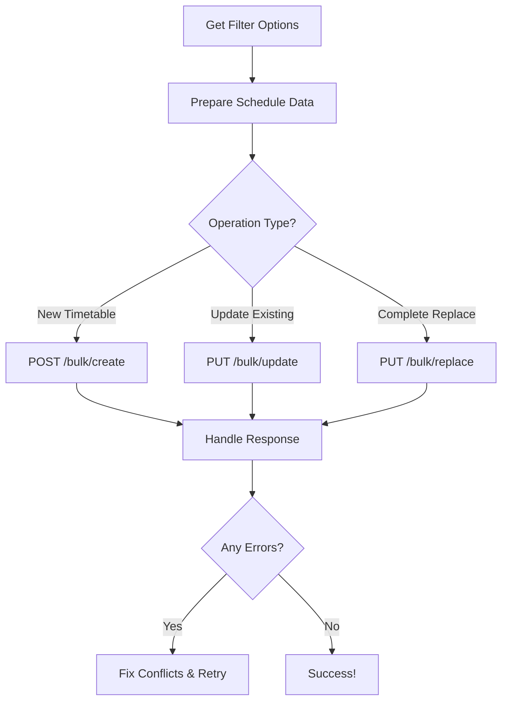

# Bulk Timetable API Documentation

## 🎯 **Overview**

The Bulk Timetable APIs allow you to create, update, or replace entire class timetables with a single API call, instead of making multiple individual requests.

## 📡 **Available Endpoints**

### **1. Create Bulk Timetable**
```http
POST /api/timetable/bulk/create
```

**Purpose**: Create multiple schedule entries for a class at once

**Request Body**:
```json
{
    "class_id": 69,
    "replace_existing": false,
    "schedules": [
        {
            "subject_id": 1,
            "teacher_id": 5,
            "day_of_week": "monday",
            "start_time": "09:00",
            "end_time": "09:45",
            "room_number": "A-101",
            "notes": "Morning session"
        },
        {
            "subject_id": 2,
            "teacher_id": 7,
            "day_of_week": "monday",
            "start_time": "10:00",
            "end_time": "10:45",
            "room_number": "A-102",
            "notes": null
        }
    ]
}
```

**Response**:
```json
{
    "status": "success",
    "message": "Bulk timetable created successfully",
    "data": {
        "success_count": 2,
        "error_count": 0,
        "created_schedules": [
            {
                "id": 101,
                "class_id": 69,
                "subject_id": 1,
                "teacher_id": 5,
                "day_of_week": "monday",
                "start_time": "09:00:00",
                "end_time": "09:45:00",
                "room_number": "A-101",
                "notes": "Morning session",
                "is_active": true,
                "created_at": "2025-08-27T10:30:00.000000Z",
                "class": {
                    "id": 69,
                    "name": "Grade 5A"
                },
                "subject": {
                    "id": 1,
                    "name": "Mathematics"
                },
                "teacher": {
                    "id": 5,
                    "user": {
                        "id": 15,
                        "name": "Mr. John Smith"
                    }
                }
            }
        ],
        "errors": []
    }
}
```

---

### **2. Update Bulk Timetable**
```http
PUT /api/timetable/bulk/update
```

**Purpose**: Update/create/delete multiple schedule entries for a class

**Request Body**:
```json
{
    "class_id": 69,
    "schedules": [
        {
            "id": 101,
            "action": "update",
            "subject_id": 1,
            "teacher_id": 5,
            "day_of_week": "monday",
            "start_time": "09:00",
            "end_time": "09:45",
            "room_number": "A-103",
            "notes": "Updated room"
        },
        {
            "action": "create",
            "subject_id": 3,
            "teacher_id": 8,
            "day_of_week": "tuesday",
            "start_time": "11:00",
            "end_time": "11:45",
            "room_number": "B-201"
        },
        {
            "id": 102,
            "action": "delete"
        }
    ]
}
```

**Response**:
```json
{
    "status": "success",
    "message": "Bulk timetable updated successfully",
    "data": {
        "created_count": 1,
        "updated_count": 1,
        "deleted_count": 1,
        "error_count": 0,
        "created_schedules": [...],
        "updated_schedules": [...],
        "deleted_schedule_ids": [102],
        "errors": []
    }
}
```

---

### **3. Replace Entire Timetable**
```http
PUT /api/timetable/bulk/replace
```

**Purpose**: Replace all existing schedules for a class with new ones

**Request Body**:
```json
{
    "class_id": 69,
    "schedules": [
        {
            "subject_id": 1,
            "teacher_id": 5,
            "day_of_week": "monday",
            "start_time": "09:00",
            "end_time": "09:45",
            "room_number": "A-101"
        },
        {
            "subject_id": 2,
            "teacher_id": 7,
            "day_of_week": "monday",
            "start_time": "10:00",
            "end_time": "10:45",
            "room_number": "A-102"
        }
    ]
}
```

---

## 🔧 **Field Specifications**

### **Required Fields (All APIs)**
- `class_id`: Integer (must exist in classes table)
- `schedules`: Array (minimum 1 schedule)

### **Schedule Object Fields**
| Field | Type | Required | Description |
|-------|------|----------|-------------|
| `subject_id` | Integer | Yes | Must exist in subjects table |
| `teacher_id` | Integer | Yes | Must exist in teachers table |
| `day_of_week` | String | Yes | monday, tuesday, wednesday, thursday, friday, saturday, sunday |
| `start_time` | String | Yes | Format: HH:MM (24-hour) |
| `end_time` | String | Yes | Format: HH:MM, must be after start_time |
| `room_number` | String | No | Max 50 characters |
| `notes` | String | No | Max 500 characters |
| `is_active` | Boolean | No | Default: true (for updates only) |
| `id` | Integer | No | Required for update/delete actions |
| `action` | String | No | create, update, delete (for bulk update only) |

### **Additional Fields**
- `replace_existing`: Boolean (create API only) - If true, deletes existing schedules before creating new ones

---

## ⚡ **Usage Examples**

### **Create Weekly Timetable**
```bash
curl -X POST http://localhost/api/timetable/bulk/create \
  -H "Authorization: Bearer YOUR_TOKEN" \
  -H "Content-Type: application/json" \
  -d '{
    "class_id": 69,
    "replace_existing": true,
    "schedules": [
      {
        "subject_id": 1,
        "teacher_id": 5,
        "day_of_week": "monday",
        "start_time": "09:00",
        "end_time": "09:45",
        "room_number": "A-101"
      },
      {
        "subject_id": 2,
        "teacher_id": 7,
        "day_of_week": "monday",
        "start_time": "10:00",
        "end_time": "10:45",
        "room_number": "A-102"
      }
    ]
  }'
```

### **Update Specific Schedules**
```bash
curl -X PUT http://localhost/api/timetable/bulk/update \
  -H "Authorization: Bearer YOUR_TOKEN" \
  -H "Content-Type: application/json" \
  -d '{
    "class_id": 69,
    "schedules": [
      {
        "id": 101,
        "action": "update",
        "room_number": "A-105",
        "notes": "Room changed"
      },
      {
        "action": "create",
        "subject_id": 3,
        "teacher_id": 8,
        "day_of_week": "friday",
        "start_time": "14:00",
        "end_time": "14:45"
      }
    ]
  }'
```

---

## 🛡️ **Validation & Conflict Detection**

### **Automatic Validations**
1. **Teacher Conflicts**: Prevents same teacher being assigned to multiple classes at same time
2. **Class Conflicts**: Prevents same class having multiple subjects at same time
3. **Time Format**: Validates HH:MM format for start/end times
4. **Time Logic**: Ensures end_time is after start_time
5. **Foreign Keys**: Validates that class_id, subject_id, teacher_id exist

### **Error Handling**
- **Partial Success**: If some schedules fail, others still get created
- **Detailed Errors**: Returns specific error for each failed schedule
- **Transaction Safety**: Uses database transactions for consistency

### **Sample Error Response**
```json
{
    "status": "success",
    "message": "Bulk timetable created successfully",
    "data": {
        "success_count": 1,
        "error_count": 1,
        "created_schedules": [...],
        "errors": [
            {
                "index": 1,
                "schedule": {
                    "subject_id": 2,
                    "teacher_id": 5,
                    "day_of_week": "monday",
                    "start_time": "09:00",
                    "end_time": "09:45"
                },
                "error": "Teacher schedule conflict detected for this time slot"
            }
        ]
    }
}
```

---

## 🎯 **Best Practices**

### **For Weekly Timetable Setup**
1. Use **Replace API** for initial setup
2. Use **Update API** for modifications
3. Always validate teacher availability first

### **For Performance**
- Limit to **50 schedules per request** for optimal performance
- Use **pagination** if creating large timetables

### **For Error Handling**
- Check the `errors` array for failed schedules
- Retry failed schedules after fixing conflicts
- Use transaction-safe operations

---

## 🔄 **Integration Workflow**



This bulk timetable system allows you to efficiently manage class schedules with minimal API calls while maintaining data integrity and conflict validation! 🚀
